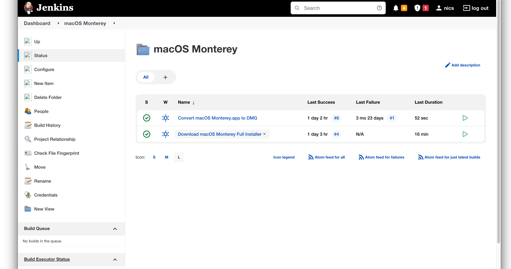

# Jenkins Build Scripts For macOS 12 Monterey




I automate part of my macOS builds for new OS releases. I use a simple script (`_version_check.sh`) that I udpate the latest release, ie ... `12.2.1`. Then I commit it to my repo and fire a webhook to Jenkins. Jenkins takes the version number and checks to see if it's available via the `softwareupdate` command.

```bash
softwareupdate --fetch-full-installer --full-installer-version "$version_to_download"
```

If it is, it downloads the full installer app, `Install macOS Monterey.app`, to the Applications folder. When that is successful, I have a second Jenkins job that converts the `.app` to a `.dmg` . I archive the `.dmg` and use it in automate workflows with [MDS](https://twocanoes.com/products/mac/mac-deploy-stick/)

